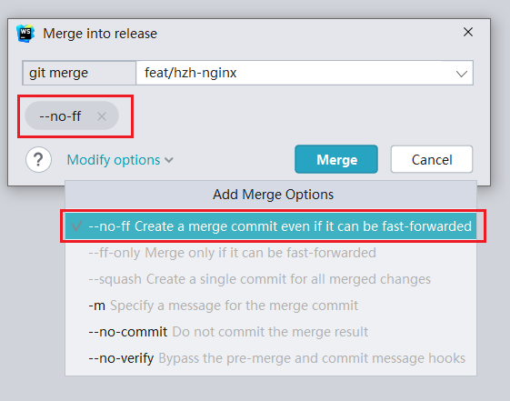

# git 操作指南

- [git 操作指南](#git-操作指南)
  - [命令介绍](#命令介绍)
  - [常见问题处理方式](#常见问题处理方式)
    - [1. 使用 `push -f` 回滚分支](#1-使用-push--f-回滚分支)
    - [2. 使用 `cherry-pick` 摘取提交到错误的分支的代码](#2-使用-cherry-pick-摘取提交到错误的分支的代码)
    - [3. 使用 `merge --no-ff` 保留分支合并痕迹](#3-使用-merge---no-ff-保留分支合并痕迹)
    - [4. 使用 `rebase -i` 将一条分支拆分成两条/合并部分提交记录](#4-使用-rebase--i-将一条分支拆分成两条合并部分提交记录)
    - [5. 使用 `pull --rebase` 保持提交记录整洁](#5-使用-pull---rebase-保持提交记录整洁)
    - [6. 使用 `commit --amend` 减少提交记录数量](#6-使用-commit---amend-减少提交记录数量)

## 命令介绍

1. `commit --amend`: 对上一次提交做修改
2. `reset`: 设置分支位置
3. `reset --hard`: 设置分支位置，放弃改动的文件
4. `reset --soft`: 设置分支位置，保持改动的文件
5. `merge`： 合并
6. `merge --no-ff`: 合并代码但不使用快进，一定会创建一个合并记录，能有效保留合并记录便于追溯
7. `pull`: 拉取代码
8. `pull --rebase`: 拉取远端代码并变基，能用于保持单条分支的整洁
9.  `push`: 推送代码
10. `push -f`: 强制推送，**谨慎使用**
11. `rebase`：变基
12. `rebase -i`: 交互式变基，可以用于更细粒度地修改提交记录
13. `cherry-pick`： 用于摘取指定提交记录

## 常见问题处理方式

### 1. 使用 `push -f` 回滚分支

1. 使用 `reset --hard` 回退本地分支（如果代码还有用的话记得另外建个分支暂存代码）

2. 使用 `push -f` 强制覆盖远程分支（只能在未保护的分支上使用）

### 2. 使用 `cherry-pick` 摘取提交到错误的分支的代码

1. 切换到目标分支
2. `cherry-pick` 摘取指定提交记录
3. 回退错误的分支

### 3. 使用 `merge --no-ff` 保留分支合并痕迹

1. IDEA: 点击菜单中的 merge，能看到高级选项

2. vscode：

### 4. 使用 `rebase -i` 将一条分支拆分成两条/合并部分提交记录

1. 使用 `rebase -i` 细粒度地修改记录

2. 根据需要修改记录

- Reword: 修改提交信息
- Squash: 将指定提交与上一次提交合并并在 commit message 中备注
- Fixup: 将指定提交与上一次提交合并但不备注，仍然沿用上一次提交的 commit message
- Drop: 丢弃指定提交

### 5. 使用 `pull --rebase` 保持提交记录整洁

### 6. 使用 `commit --amend` 减少提交记录数量

