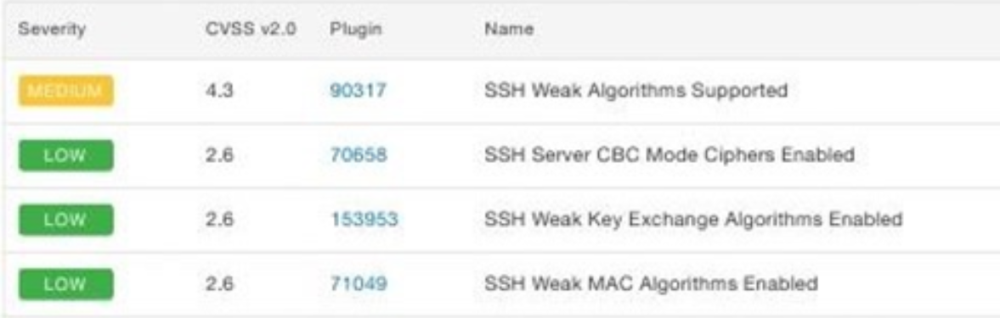

# 记一次服务器漏洞修复

**官方文档参考链接**

-	https://docs.tenable.com/tenableio/Content/Analysis/VulnerabilitySeverityIndicators.htm
-	https://www.tenable.com/plugins/nessus/39520



## 概览

服务器在使用 nessus 扫描出 4 个漏洞，均是与ssh配置相关的，能够通过修改ssh配置解决

### 1. 90317: SSH Weak Algorithms Supported

  **原因：**

  未禁用 ssh 弱加密算法

  **解决方案：**

  1. 编辑 `/etc/ssh/sshd_config`
  2. 添加 `Ciphers aes128-ctr,aes192-ctr,aes256-ctr`

### 2. 70658: SSH Server CBC Mode Ciphers Enabled

  **原因：**

  未禁用 CBC 模式的加密方式

  **解决方案：**

  沿用问题1解决方案中的配置即可

### 3. 153953: SSH Weak Key Exchange Algorithms Enabled

  **解决方案：**

  添加 `MACs hmac-sha1,hmac-ripemd160`

  **TIPS：**

  如果修改后在 `sshd -t` 验证配置时报错的话，只保留 `hmac-sha1` 一种即可

### 4. 71049: SSH Weak MAC Algorithms Enabled

  **解决方案：**

  添加 `KexAlgorithms curve25519-sha256,curve25519-sha256@libssh.org,ecdh-sha2-nistp256,ecdh-sha2-nistp384,ecdh-sha2-nistp521,diffie-hellman-group-exchange-sha256,diffie-hellman-group14-sha1`

## 总结

```
# 编辑sshd 配置文件
sudo vi /etc/ssh/sshd_config

# 在末尾添加
Ciphers aes128-ctr,aes192-ctr,aes256-ctr
MACs hmac-sha1,hmac-ripemd160
KexAlgorithms curve25519-sha256,curve25519-sha256@libssh.org,ecdh-sha2-nistp256,ecdh-sha2-nistp384,ecdh-sha2-nistp521,diffie-hellman-group-exchange-sha256,diffie-hellman-group14-sha1

#注，在低版本服务器上使用上述配置时会报错，服务器信息：centos6.5+openssh_5.3p1 OpenSSL 1.0.1.e-fips 11 Feb 2013，因此修改了KexAlgorithms的配置
KexAlgorithms diffie-hellman-group-exchange-sha256,diffie-hellman-group14-sha1

# 验证 sshd 配置

sudo sshd -t

# 重启sshd服务
service sshd restart
# 或者
systemctl restart sshd

# 在新ssh登录验证配置
```

## 参考链接

[https://blog.csdn.net/Meodream/article/details/95348639](https://blog.csdn.net/Meodream/article/details/95348639)

[https://blog.51cto.com/u_13229718/2486935](https://blog.51cto.com/u_13229718/2486935)

[https://blog.csdn.net/qq461391728/article/details/122322512](https://blog.csdn.net/qq461391728/article/details/122322512)

[https://60dmx.blogspot.com/2018/09/ssh-weak-algorithms-supported.html](https://60dmx.blogspot.com/2018/09/ssh-weak-algorithms-supported.html)

[https://support.f5.com/csp/article/K32251283](https://support.f5.com/csp/article/K32251283)
