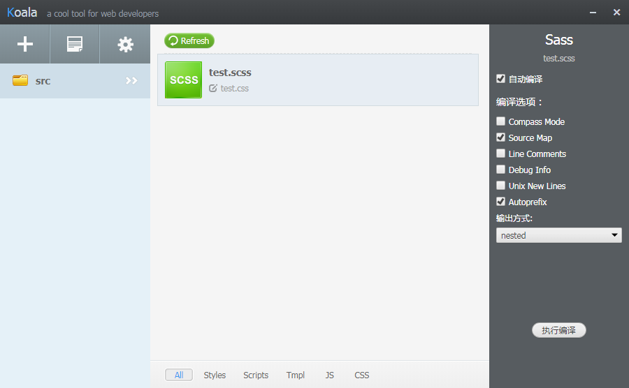
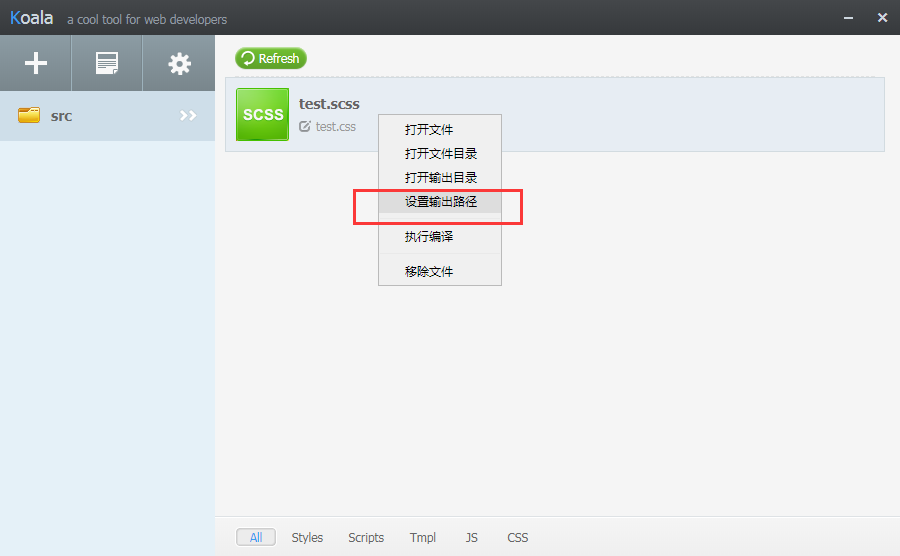

# 尝试自己安装sass #

[Sass中文网的教程](https://www.sass.hk/install/)，需要自己安装Ruby，Sass，Compass，有点麻烦而且换了国内的源也还是慢

Tips：教程上的淘宝源不能用了，要换成[http://gems.ruby-china.com/](http://gems.ruby-china.com/)

还是使用Koala好了，[下载地址](https://github.com/oklai/koala/releases)

拖入文件夹启动自动编译就可以了

PS：右键选择输出目录

